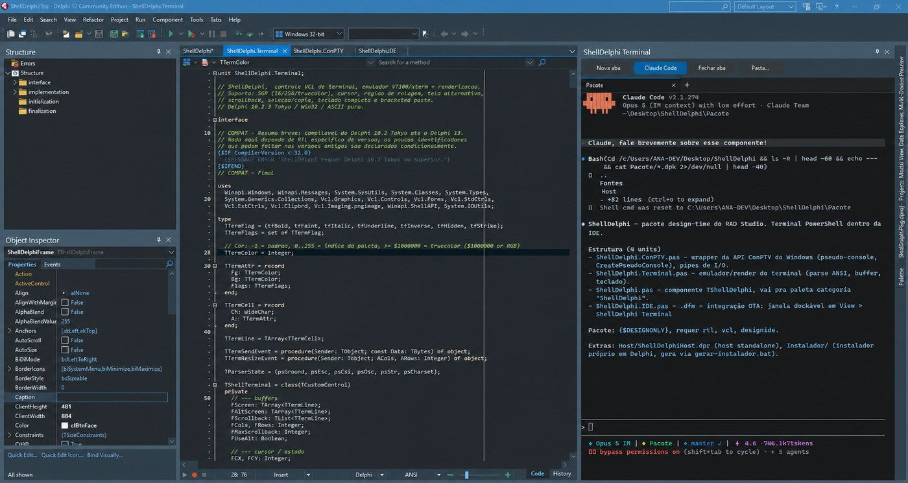

<div align="center">


### Um terminal de verdade dentro do RAD Studio

Rode **qualquer IA por linha de comando** — Claude Code, Gemini CLI, Codex, OpenCode, Aider —<br>
além de vim, htop e qualquer TUI. Com cores, cursor e mouse.<br>
Encaixa como o Object Inspector e o layout fica salvo.

[](#compatibilidade)
[](#requisitos)
[](#como-funciona)
[](LICENSE)

</div>

---

## O problema

O RAD Studio não tem terminal. Para rodar `git`, `npm`, um script — ou qualquer assistente de IA por linha de comando — você alterna para uma janela do PowerShell, perde o contexto do projeto e volta.

E as soluções que existem abrem um console cru: sem cores, sem cursor, sem TUI. `vim` não desenha. Nenhum CLI de IA funciona, porque todos usam interface de terminal interativa.

## A solução

**ShellDelphi** usa **ConPTY**, a mesma API do Windows Terminal. É um pseudoterminal real, não um redirecionamento de `stdout`.

O resultado: qualquer programa de terminal roda exatamente como rodaria fora da IDE — inclusive os que desenham a tela inteira e leem o teclado tecla a tecla.

### Agentes de IA no seu projeto Delphi

Como o terminal é real, qualquer CLI de IA funciona dentro da IDE, já na pasta do projeto aberto:

```
claude          # Claude Code
gemini          # Gemini CLI
codex           # OpenAI Codex CLI
opencode        # OpenCode
aider           # Aider
```

Sem alternar de janela, sem perder o contexto, sem copiar caminho de arquivo na mão.

<div align="center">



<sub>O terminal encaixado à direita, rodando o Claude Code na pasta do projeto aberto.</sub>

</div>

---

## Recursos

| | |
|---|---|
| 🖥️ **ConPTY nativo** | pseudoterminal real — TUI, cores 24 bits, cursor, mouse |
| 🧩 **Encaixa na IDE** | como Object Inspector; o RAD Studio guarda o layout |
| 📑 **Abas** | várias sessões, cada uma na sua pasta |
| 🤖 **Pronto para CLI de IA** | Claude Code, Gemini, Codex, OpenCode, Aider — e um botão que abre o Claude Code na pasta do projeto |
| 🎨 **Emulador VT100/xterm** | SGR, tela alternativa, região de rolagem, bracketed paste |
| 📜 **Histórico de 5000 linhas** | roda, barra e teclado |
| 📋 **Copiar e colar de verdade** | seleção com o mouse, `Ctrl+V`, `Ctrl+Shift+C` |
| 🖼️ **Arrastar arquivos e colar imagem** | a imagem vira `.png` e o caminho é digitado |

---

## Instalação

> [!IMPORTANT]
> Feche o RAD Studio **por completo** antes de instalar. Com a IDE aberta o pacote fica travado e não pode ser regravado.

### Pelo instalador — recomendado

1. Baixe o [**`ShellDelphiInstall.exe`**](ShellDelphiInstall.exe)
2. Execute
3. Escolha a pasta de destino
4. Marque as versões do RAD Studio e clique em **Instalar**
5. Abra a IDE: menu **View → ShellDelphi Terminal**

O instalador carrega os fontes dentro dele — não precisa baixar mais nada. Ele detecta as versões instaladas, compila, registra na IDE e ajusta o *Library Path*.

Quando alguma versão não pode receber o pacote, ele diz o motivo e o que fazer:

| Situação | O que o instalador faz |
|---|---|
| Licença sem build por linha de comando | manda abrir o `.dproj` e fazer Build + Install |
| IDE aberta | detecta antes de compilar e pede para fechar |
| Personalidade Delphi ausente | manda rodar o instalador do RAD Studio em *Modify* |

### Pelo código-fonte

```
1. Feche o RAD Studio
2. File > Open Project... > Pacote\ShellDelphiPkg.dproj
3. Plataforma Win32
4. Botão direito no ShellDelphiPkg.bpl > Build
5. Botão direito no ShellDelphiPkg.bpl > Install
6. Menu View > ShellDelphi Terminal
```

**Desinstalar:** `Component → Install Packages... → selecione → Remove`

---

## Atalhos

### Teclado

| Atalho | O que faz |
|---|---|
| `Ctrl+V` · `Ctrl+Shift+V` · `Shift+Insert` | colar |
| `Ctrl+Shift+C` · `Ctrl+Insert` | copiar |
| `Ctrl+C` | copia se houver seleção; senão interrompe |
| `Ctrl+Shift+A` | selecionar tudo |
| `Ctrl/Alt+Backspace` | apagar a palavra |
| `Shift+PageUp` · `PageDown` | rolar o histórico, uma tela |
| `Shift+↑` · `↓` | rolar uma linha |
| `Shift+Home` · `End` | início do histórico · voltar ao fim |
| `Ctrl+Shift+D` | diagnóstico do scroll na própria tela |

> [!NOTE]
> Com o terminal em foco as teclas vão para o programa que está rodando, **não para a IDE** — inclusive `ESC`, `Tab`, setas, `F12` e `Ctrl+S`. É isso que faz os CLIs de IA e o vim funcionarem.
> Combinações com **Alt** continuam indo para a IDE. Para usar um atalho do RAD Studio, tire o foco do terminal antes.

### Mouse

| Ação | O que faz |
|---|---|
| Arrastar com o esquerdo | seleciona e copia ao soltar |
| Botão direito | cola |
| Roda | rola o histórico |
| Roda dentro de uma TUI | rola dentro do programa |
| **Shift** + roda | força rolar o histórico do terminal |

---

## Compatibilidade

| Versão | Compila | Instala na IDE |
|---|:---:|:---:|
| Delphi 10.2 Tokyo | ✅ | ✅ |
| Delphi 10.3 Rio | ✅ | ✅ |
| Delphi 10.4 Sydney | ✅ | ✅ |
| Delphi 11 Alexandria | ✅ | ✅ |
| Delphi 12 Athens | ✅ | ✅ |
| Delphi 13 | ✅ | ✅ |

Toda a API usada está presente em todas essas versões — o código não tem nenhuma ramificação por versão. Encontrou algum problema? [Abra uma issue](../../issues).

### Requisitos

- **Windows 10 versão 1809** ou superior — o ConPTY não existe antes disso
- Plataforma **Win32** (a IDE do RAD Studio é 32 bits)

---

## Como funciona

```
┌─────────────────────────────────────────┐
│  RAD Studio                             │
│  ┌───────────────────────────────────┐  │
│  │  ShellDelphi (janela dockável)    │  │
│  │  ┌─────────────────────────────┐  │  │
│  │  │  Emulador VT100/xterm       │  │  │
│  │  │  desenha em Canvas próprio  │  │  │
│  │  └──────────┬──────────────────┘  │  │
│  └─────────────┼─────────────────────┘  │
└────────────────┼────────────────────────┘
                 │  ConPTY
        ┌────────┴─────────┐
        │  powershell.exe  │
        │  claude, gemini  │
        │  vim, htop...    │
        └──────────────────┘
```

O componente cria o pseudoconsole com `CreatePseudoConsole` (carregado por `GetProcAddress`, sem link estático), lê a saída num thread dedicado e alimenta um emulador de terminal próprio, que desenha direto no `Canvas`.

A entrada passa por um filtro em `Application.OnMessage` — é o único ponto anterior ao pré-processamento da IDE, e é o que permite `ESC` e as setas chegarem ao programa em vez de serem consumidas pelo RAD Studio.

---

## Estrutura do projeto

```
ShellDelphiInstall.exe   o instalador

Fontes/                  código-fonte do componente
Pacote/                  projeto do pacote para a IDE
Projetos/                terminal em processo separado (opcional)
Doctos/                  documentação e identidade visual
```

---

## Contribuindo

Issues e pull requests são bem-vindos. O que ajuda mais agora:

- Relatar qualquer TUI que não renderize corretamente
- Melhorias no emulador VT100/xterm
- Testes em monitor com DPI alto

---

<div align="center">

Feito por **Ana Laura Corrêa**

</div>
